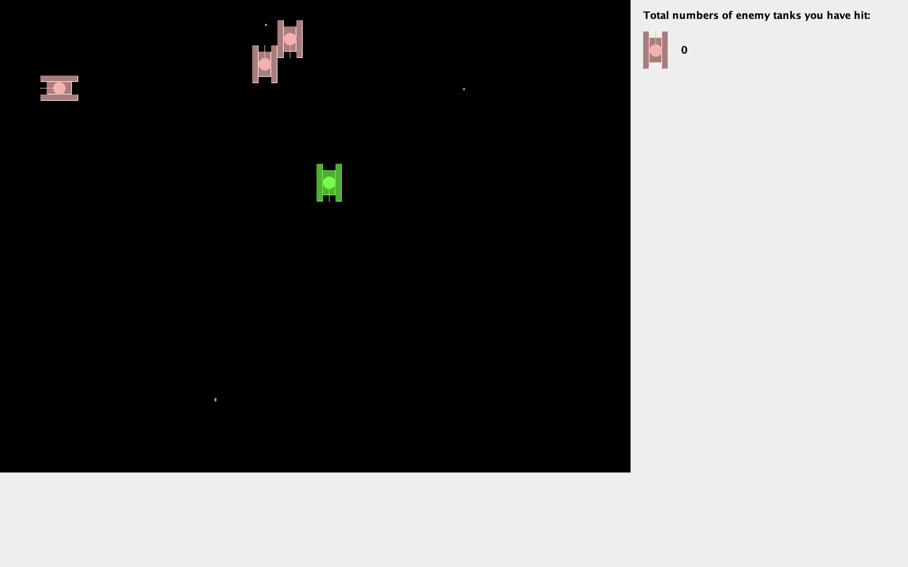
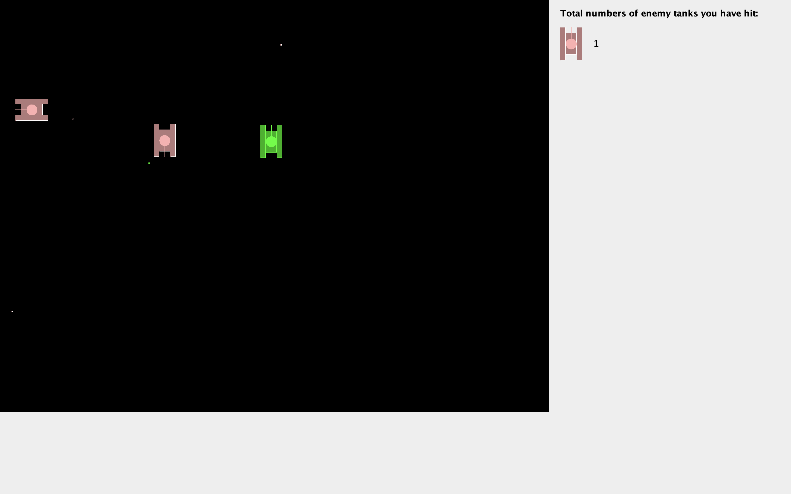

# Java Tank Project

A simple yet engaging tank battle game written in Java, showcasing the use of Java threads and object-oriented programming principles. This project demonstrates proficiency in **multithreaded programming** and **object-oriented design**, providing a fun way to learn and practice core Java concepts.

---

## Project Overview

- **Multithreaded Programming:** Multiple tanks and game elements run concurrently using Java's threading mechanisms.  
- **Object-Oriented Design:** Different elements of the game (tanks, bullets, bombs, etc.) are modeled as objects, resulting in a clear, maintainable, and extensible code structure.  
- **Game Logic:** Includes tank movement, shooting, collision detection, scoring, and the ability to load/save game progress.  

---

## Screenshot

Below is a snapshot of the running game interface:





---

## How to Compile & Run

1. **Clone or download**
   this repository, and navigate into the project directory.

2. **Compile all source files**:
   ```bash
   find src -name "*.java" > sources.txt
   javac -d bin @sources.txt
   ```
   
3.**Copy the resource files**:
   ```bash
   cp src/com/wpy/tankgame/*.png bin/com/wpy/tankgame/
   ```

4.**Run the game:**:
   ```bash
   java -cp bin com.wpy.tankgame.Main
   ```
You will be prompted to choose:
- **1** for a new game, or
- **2** to load the previous game state (if available).

---

## Controls
- **W/A/S/D:** Move your tank (Up / Left / Down / Right)
- **J:** Shoot
When you close the window, the game automatically saves the current state to record.txt (if you choose to implement or load saved progress).

---

## Project Features

- **Threaded Enemy Tanks**  
  Enemy tanks are each managed by a separate thread, allowing them to move and shoot independently.

- **Collision Detection & Bomb Effects**  
  When bullets hit tanks, explosions (bomb animations) are rendered, and scores are tracked.

- **Save & Load Mechanism**  
  The game can save the positions of enemy tanks and the player’s score to `record.txt`, then load them on startup if the user chooses “2”.

- **Expandable Design**  
  The code follows an object-oriented approach, making it simpler to add new features (e.g., power-ups, advanced AI, more complex collision logic) in the future.

<p align="center">Enjoy the game and happy coding!</p> 
